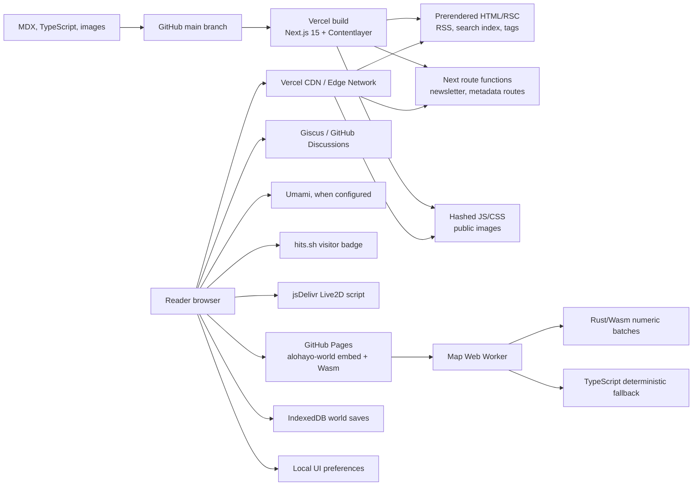
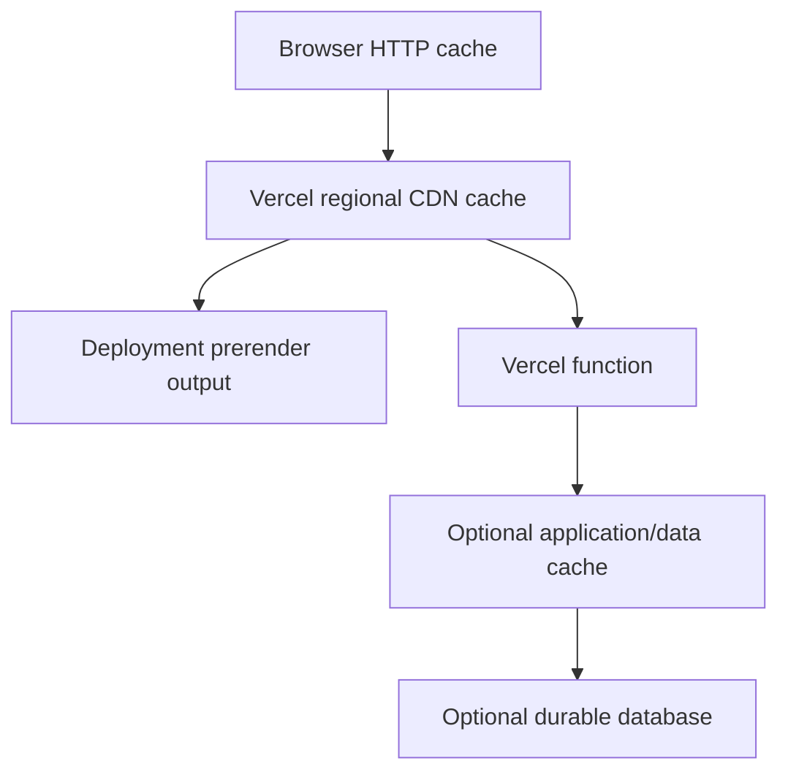
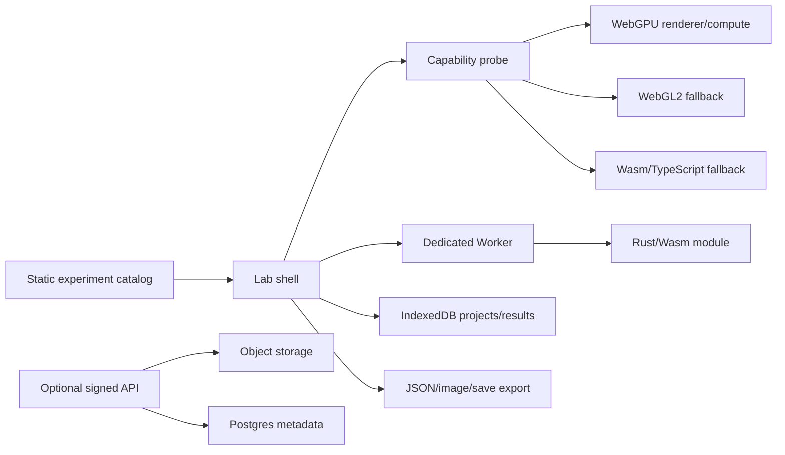

# AlohaYo Site Architecture and Extension Plan

- **Status:** approved target architecture
- **Evidence snapshot:** 2026-07-30
- **Primary site:** [alohayo.me](https://alohayo.me)
- **Experimental domain:** [alohayo.fun](https://alohayo.fun)

## 1. Executive decision

Keep `alohayo.me` static-first on Vercel. Build the article corpus, indexes, metadata,
RSS, and most interactive article components at deploy time or in the browser. Add a
database only when a feature needs shared, durable server state.

Use `alohayo.fun` as a separate laboratory and optional service origin. This isolates
WebGPU, threaded WebAssembly, map serving, and experimental security headers from the
blog's comments, analytics, remote game module, and other third-party integrations.

The target is a hybrid system:

- **Vercel:** public site, static pages and assets, preview deployments, small APIs.
- **GitHub:** content source, review history, comments through Giscus, and the
  `alohayo-world` release pipeline.
- **Managed storage when justified:** Postgres, Redis, and object storage selected by
  data shape rather than by fashion.
- **`alohayo.fun` on Aliyun:** isolated browser laboratory and, later, bounded workloads
  that genuinely require a continuously running process.

Do not turn the Aliyun host into the primary database or API by default. That would add
backups, patching, monitoring, security, regional latency, and compliance work before a
feature requires any of them.

## 2. Scope and provenance

This plan covers four independently owned surfaces:

| Surface               | Source of truth                          | Current delivery                         |
| --------------------- | ---------------------------------------- | ---------------------------------------- |
| Blog and portfolio    | `GarfieldZHU/alohayo.blog`               | Vercel project `alohayo-blog`            |
| Procedural world/game | sibling repo `GarfieldZHU/alohayo-world` | GitHub Pages assets embedded by the blog |
| Comments              | GitHub Discussions through Giscus        | Giscus iframe                            |
| Experimental server   | `alohayo.fun` / `47.99.103.178`          | Aliyun VM behind Caddy                   |

The local directory is named `alohayo.blog`, while the Vercel project is named
`alohayo-blog`. Git remote, Vercel Git metadata, and the production commit SHA confirm
that these are the same deployment.

## 3. Current architecture



### 3.1 Build and content flow

- Next.js 15 App Router and React 19 provide the application shell.
- Contentlayer reads `data/blog/**/*.mdx` and `data/authors/**/*.mdx` during the build.
- Build-time processing derives slugs, reading time, table of contents, JSON-LD, tags,
  citations, KaTeX, syntax highlighting, RSS, and the local `search.json` index.
- `generateStaticParams` enumerates blog slugs and tags, so article routes are
  prerendered.
- Client components provide theme selection, search UI, terminal interactions, game
  launching, comments, and local preferences after hydration.
- Production does not set `EXPORT`, so this is a normal Next.js deployment, not
  `output: "export"`. Vercel can therefore serve prerendered output and route functions
  from one deployment.

This is correctly described as **static-first** rather than **pure static**. The public
content does not need a request-time database, but the repository retains server
capability.

The verified production build generated 77 static/SSG pages. The only route classified
as request-time dynamic was `/api/newsletter`. Shared first-load JavaScript was 102 kB;
the home route reported 122 kB and the game launcher 109 kB before the separately loaded
game bundle. These numbers are baselines, not permanent budgets.

### 3.2 Runtime integrations

| Integration        | Purpose                                                | State ownership                          |
| ------------------ | ------------------------------------------------------ | ---------------------------------------- |
| Giscus             | comments and reactions                                 | GitHub Discussions                       |
| Umami              | privacy-oriented analytics when `NEXT_UMAMI_ID` exists | external analytics service               |
| hits.sh            | public visitor badge                                   | external counter                         |
| Buttondown adapter | newsletter subscription                                | Next route handler plus provider         |
| PokeAPI            | home terminal demo                                     | browser fetch                            |
| Live2D             | decorative character                                   | browser-loaded jsDelivr/GitHub script    |
| Alohayo World      | interactive procedural world                           | GitHub Pages assets; local browser state |

### 3.3 Current game/Wasm boundary

`/game` does not bundle the game into the blog. It waits for explicit user action, then
dynamically imports a versioned bootstrap module from GitHub Pages.

The sibling `alohayo-world` architecture already has the right performance boundary:

- PixiJS, DOM UI, input, lifecycle, rendering, and persistence remain in TypeScript.
- Full-world and chunk generation run off the main thread in a Web Worker.
- Rust/Wasm owns coarse deterministic numeric batches, not one call per map cell.
- Typed arrays cross the worker boundary.
- TypeScript remains a tested fallback if the Wasm module, ABI, or output validation
  fails.
- IndexedDB stores versioned autosaves and named save slots; `localStorage` stores small
  preferences.

The existing performance evidence is meaningful:

| Batch             | TypeScript median | Wasm median | Improvement | Status                   |
| ----------------- | ----------------: | ----------: | ----------: | ------------------------ |
| Chunk base layers |          1.595 ms |    0.903 ms | 43.4% lower | default-on with fallback |
| Hydrology raster  |          1.444 ms |    0.554 ms | 61.7% lower | default-on with fallback |

This means “add Wasm” is no longer a useful goal by itself. Future migration candidates
must be profiled worker batches such as render hints, contour geometry, or path-cost
grids. Rendering and DOM work should not move to Wasm without evidence.

## 4. Delivery, CDN, and cache layers



These layers solve different problems and must not be described as one cache.

### 4.1 Observed production behavior

Read-only production checks on 2026-07-30 showed:

| Resource                       | Observed behavior                              | Meaning                                                           |
| ------------------------------ | ---------------------------------------------- | ----------------------------------------------------------------- |
| `/`, `/blog/`, `/game/`        | `x-nextjs-prerender: 1`, `x-vercel-cache: HIT` | HTML/RSC is prerendered and served from Vercel's CDN              |
| Hashed `/_next/static/...` CSS | `max-age=31536000, immutable`, CDN HIT         | content-addressed framework assets are cached for one year        |
| `/static/images/logo.png`      | `max-age=0, must-revalidate`                   | public filenames are stable and revalidated rather than immutable |
| Game bootstrap and `.wasm`     | GitHub Pages/Fastly, `max-age=600`             | the separate release origin has a ten-minute edge TTL             |
| `/api/newsletter/`             | HTTP 500, CDN MISS                             | the dynamic newsletter path is currently unhealthy                |

The sample request reached Vercel location `iad1`; that identifies the point of presence
for the probe, not a permanent origin location.

### 4.2 Cache rules

- Preserve deployment-generated caching for prerendered pages.
- Preserve immutable caching for hashed Next.js assets.
- Do not mark mutable public filenames immutable unless filenames include a content hash.
- Cache public, non-personalized GET APIs explicitly with
  `Vercel-CDN-Cache-Control`; never cache authenticated or user-specific responses
  publicly.
- Prefer on-demand, narrow cache invalidation over frequent time-based regeneration if a
  future CMS or database is introduced.
- Keep Redis out of the initial architecture. Add it only for rate limits, short-lived
  sessions, queues, or a real hot-read workload; it is not a substitute for the CDN.

## 5. Immediate corrections before expansion

These are higher value than adding another platform:

1. **Repair or disable the newsletter route.** It advertises a feature but currently
   returns HTTP 500. Validate provider credentials in Vercel and return a controlled
   configuration error instead of an opaque failure.
2. **Pin the Live2D asset.** `@latest` makes production non-reproducible and expands
   supply-chain risk. Pin a commit or release and, where possible, self-host the verified
   artifact.
3. **Tighten CSP.** `connect-src *`, `unsafe-eval`, and `unsafe-inline` are broad.
   Inventory actual origins, remove unused allowances, and introduce nonces/hashes where
   practical.
4. **Add deployment checks.** Smoke-test `/`, one article, `/game`, RSS, sitemap, and any
   enabled API against a preview before production promotion.
5. **Record cache checks.** Include a small header probe in the release runbook so CDN
   behavior is verified rather than assumed.
6. **Make type checking a real gate.** `next.config.js` currently sets
   `typescript.ignoreBuildErrors: true`, and the production build reports that type
   validation is skipped. A direct `tsc --noEmit` currently fails on unresolved Pliny
   subpath declarations plus several local type errors. Fix that baseline, add the
   command to CI, then stop ignoring build errors.

## 6. Cutting-edge blog features

The strongest differentiator is not more social widgets. It is making technical posts
executable, spatial, and inspectable while preserving fast reading.

### 6.1 Recommended feature set

#### A. Interactive MDX lab blocks

Create a narrow component registry for MDX:

- `CodePlayground`: editable TypeScript/JavaScript examples in a sandboxed iframe.
- `WasmDemo`: lazy-loads a versioned Wasm module and displays timing, memory, and fallback
  diagnostics.
- `WebGPUDemo`: capability-gated canvas with WebGL2 or CPU fallback.
- `MapStory`: synchronized prose, camera positions, markers, and data layers.
- `BenchmarkPanel`: reproducible inputs, median/p95 results, device information, and
  downloadable JSON.

Every block must render a useful static placeholder without JavaScript. Heavy code loads
only after intersection or explicit activation, and every experiment has an error and
fallback state.

#### B. Build-time knowledge graph

Derive links between articles, tags, citations, projects, and experiments during the
Contentlayer build. Add:

- backlinks and “related experiments”;
- a graph view that loads only on demand;
- link validation and orphaned-post reporting in CI;
- stable IDs in frontmatter so URLs can change without breaking relationships.

This needs no database while the content remains Git-authored.

#### C. Search progression

1. Keep the current local Kbar index for title, summary, tag, and body search.
2. Add a client-side ranked index only if current recall is insufficient.
3. Add embeddings/vector search only after defining a measurable query set that lexical
   search fails.

Semantic search would justify a managed vector store or Postgres `pgvector`; it should
not be the first storage feature.

#### D. Spatial publishing

Add optional location frontmatter to posts and projects:

```yaml
places:
  - id: toronto
    longitude: -79.3832
    latitude: 43.6532
    role: visited
```

Build a journey map and location pages from this data. Start with small GeoJSON generated
at build time. Adopt vector tiles only after the dataset or styling complexity exceeds
what GeoJSON can handle.

#### E. Progressive ownership

- Generate per-post Open Graph images from article metadata.
- Add local annotations/bookmarks using IndexedDB before adding accounts.
- Keep Giscus for public discussion until moderation or identity requirements exceed it.
- Consider Webmentions only if IndieWeb interoperability is a real publishing goal.

## 7. Playground architecture

### 7.1 Why isolate it

Threaded Wasm uses `SharedArrayBuffer`, which requires cross-origin isolation through
COOP/COEP headers. Applying those headers globally to `alohayo.me` can break or complicate
Giscus, remote GitHub Pages modules, analytics, Live2D, and other cross-origin resources.

Host the strict environment at `alohayo.fun`:

```text
Cross-Origin-Opener-Policy: same-origin
Cross-Origin-Embedder-Policy: require-corp
Cross-Origin-Resource-Policy: same-origin
```

Keep experiment assets same-origin or require explicit CORS/CORP headers. Start with a
normal link from the blog. If embedding is later required, allow only
`https://alohayo.me` through `Content-Security-Policy: frame-ancestors` and add
`https://alohayo.fun` to the blog's `frame-src`.

### 7.2 Playground component model



Each experiment is an independently loadable package with:

- a manifest containing ID, version, capabilities, assets, and fallback;
- its own worker and cleanup contract;
- deterministic seed/input export;
- device and adapter diagnostics;
- a static screenshot and explanation for unsupported browsers;
- performance budgets and browser tests.

Normal blog routes must download **zero playground JavaScript**.

### 7.3 WebGPU track

WebGPU is available in all major browser families on supported OS/GPU combinations,
including Safari 26 and current Chrome/Edge and Firefox releases on documented
platforms. OS, GPU, driver, and mobile coverage still differs. Always check
`navigator.gpu`, request an adapter defensively, handle device loss, and retain a
fallback.

Recommended experiments:

1. WGSL shader gallery with live uniform controls.
2. Compute-based particle, fluid, or reaction-diffusion simulation.
3. Terrain erosion visualizer using the same deterministic seed as Alohayo World.
4. GPU-generated heightfield, contour, and normal-map comparison against Wasm.
5. Tile/point-cloud stress laboratory with visible frame and memory budgets.

Do not immediately rewrite Alohayo World's PixiJS renderer. First implement one isolated
WebGPU experiment and compare startup time, frame time, memory, device coverage, and
maintenance cost against the current renderer.

### 7.4 Wasm track

Continue the sibling repository's measured migration policy:

- keep Wasm in workers;
- use coarse typed-array ABIs;
- retain deterministic TypeScript references;
- require byte/hash parity;
- record module startup, transfer bytes, median/p95 runtime, and fallback reasons;
- migrate only batches with a demonstrated material benefit.

Next credible candidates are render hints, contour/frontier geometry, and path-cost
grids. Threading is a separate experiment, not an automatic improvement: worker
scheduling, shared memory, synchronization, and stricter headers add complexity.

### 7.5 Map track

There are two distinct map products:

1. **Real-world story map:** posts, travel, projects, and datasets on Earth.
2. **Alohayo World:** deterministic procedural geography and gameplay.

Do not force them into one model. Share interaction patterns and experiment tooling, not
coordinate semantics.

For the real-world map:

- Start with MapLibre GL JS and generated GeoJSON.
- Use PMTiles in object storage when the dataset becomes tile-sized. PMTiles supports
  HTTP range requests and CDN-friendly serverless delivery.
- Add terrain through raster DEM only if a story requires it.
- Run Martin with PostGIS only for frequently changing, query-driven vector tiles. A
  static personal map does not need a tile server.

For the procedural world:

- keep generation in `alohayo-world`;
- expose stable experiment inputs and diagnostic exports through its embed API;
- use the lab for comparative WebGPU/Wasm renderers without coupling the blog to engine
  internals.

## 8. Persistence decision

### 8.1 No database is the default

Git already persists articles, configuration, and review history. The browser already
persists local world saves in IndexedDB. Continue without a database for:

- posts, tags, citations, projects, and place metadata;
- interactive demos with export/import;
- local bookmarks, settings, and drafts;
- the static journey map;
- single-device Alohayo World saves.

### 8.2 Features that justify shared storage

| Feature                                 | Durable store                                   | Supporting store                         |
| --------------------------------------- | ----------------------------------------------- | ---------------------------------------- |
| Cross-device world saves                | Postgres metadata + Blob payloads               | Redis rate limits                        |
| Accounts and profiles                   | Postgres                                        | Redis session/rate limit only if needed  |
| Reactions/view counts owned by the site | Postgres                                        | Redis aggregation buffer optional        |
| Playground project sharing              | Postgres metadata + Blob artifacts              | queue for compilation optional           |
| Leaderboards                            | Postgres source of truth                        | Redis sorted set for hot ranking         |
| Semantic search                         | Postgres + `pgvector` or managed vector service | cached query results optional            |
| Dynamic geospatial queries              | Postgres + PostGIS                              | Martin tile service if tiles are dynamic |

### 8.3 Recommended managed path

Use a Vercel Marketplace integration:

- **Neon Postgres** for relational and vector data.
- **Upstash Redis** only for rate limiting, ephemeral coordination, and hot rankings.
- **Vercel Blob** for large save files, screenshots, compiled artifacts, and tile
  archives.

This requires no additional always-on server. Vercel injects credentials into the
project environment. Place database compute in a region close to the Vercel function
region, use pooled/serverless connections, validate all writes, and apply per-user
authorization in the API rather than trusting client IDs.

Supabase is a reasonable alternative if integrated authentication, storage, and realtime
subscriptions are more valuable than keeping each service narrow.

### 8.4 Minimal service boundary

Never connect the browser directly with a privileged database credential.

```text
Browser
  -> authenticated/rate-limited Next route or alohayo.fun API
  -> authorization and schema validation
  -> Postgres / Blob
  -> narrow response
```

Initial tables, only when required:

- `users`
- `world_saves` with engine/schema/content versions and blob checksum
- `playground_projects` with experiment/version/input metadata
- `reactions` with a uniqueness constraint
- `map_places` only if places become user-authored

Keep content posts in Git. Moving them into a CMS/database would weaken the current
reviewable publishing model without solving an identified problem.

## 9. Role of `alohayo.fun` and the Aliyun server

### 9.1 Verified public state

On 2026-07-30:

- `alohayo.fun` resolved directly to `47.99.103.178`.
- The address is allocated to Aliyun Computing in Hangzhou.
- Caddy redirected HTTP to HTTPS.
- A valid Let's Encrypt certificate covered `alohayo.fun`.
- HTTPS returned Caddy HTTP 404, so no public application was attached to the domain.

CPU, memory, disk, operating-system state, firewall rules, backup state, and SSH posture
were not verified. Do not assign production workloads until that inventory is complete.

### 9.2 Good uses

1. Static isolated lab with strict COOP/COEP headers.
2. Small signed API for long-running experiment jobs that exceed function limits.
3. Martin tile server only after dynamic PostGIS-backed tiles are required.
4. WebSocket collaboration prototype after authentication and abuse controls exist.
5. Private build worker for large map/PMTiles generation, with outputs published to
   object storage rather than served from the VM disk.

### 9.3 Poor initial uses

- primary production database;
- public Redis/Postgres ports;
- authoritative store without off-host backups;
- global large-file/CDN origin;
- unbounded code execution for anonymous playground users.

### 9.4 Server requirements before use

- Inventory OS, CPU, RAM, disk, bandwidth, and region.
- Patch the OS and Caddy; run application processes as non-root.
- Permit public ingress only on 80/443; restrict SSH by key and source where practical.
- Keep Postgres/Redis on private interfaces or a container network.
- Add system service supervision, log rotation, resource limits, and health checks.
- Add off-host encrypted backups and prove restoration.
- Add uptime, disk, memory, certificate, and application-error monitoring.
- Store secrets outside images and repositories.
- Rate-limit public APIs and enforce request/body/time limits.
- Define a rollback artifact and deployment procedure.

Because this is a mainland-China-hosted public endpoint, confirm ICP filing and any
applicable public-security registration before serving a public information service.

## 10. Phased extension plan

### Phase 0 — make the current platform trustworthy

**Requirements**

- Fix or intentionally remove the newsletter endpoint.
- Pin remote executable assets.
- Add preview smoke tests and cache-header checks.
- Add a passing type-check gate and remove the build-error bypass.
- Document ownership between the blog and `alohayo-world`.

**Exit criteria**

- Main pages, RSS, sitemap, comments, and game launch pass in production.
- Enabled APIs return controlled success/error responses.
- No unversioned remote executable asset remains.

### Phase 1 — static interactive publishing

**Requirements**

- Add the MDX experiment registry and lazy-loading contract.
- Add build-time backlinks/related content.
- Add optional place frontmatter and a GeoJSON journey map.
- Add static screenshots and unsupported-browser states.

- **Infrastructure:** existing Vercel and GitHub only.
- **Database:** none.

**Exit criteria**

- Ordinary article routes load no experiment bundle until activation.
- Link graph and location data are validated during the build.
- One Wasm article demo and one MapLibre story pass mobile/desktop browser tests.

### Phase 2 — isolated `alohayo.fun` lab

**Requirements**

- Inventory and harden the server.
- Configure Caddy for a versioned static lab deployment and strict isolation headers.
- Add capability diagnostics and one WebGPU experiment with fallback.
- Define cross-origin linking/embedding policy.
- Complete ICP/compliance checks before public launch.

**Database:** none. Use IndexedDB and export/import.

**Exit criteria**

- `crossOriginIsolated === true` in supported browsers.
- WebGPU device loss and unsupported paths are visible and recoverable.
- Blog integrations remain unchanged and functional.
- Deployment and rollback are automated and documented.

### Phase 3 — optional shared state

Start only when a selected feature requires it.

**Requirements**

- Select Neon or Supabase and place it near application compute.
- Add authentication, authorization, schema migrations, rate limits, deletion/export,
  backups, and privacy documentation.
- Use Blob for large payloads and checksums for integrity.

**Exit criteria**

- Cross-device save or project sharing works across two browsers.
- Users can export and delete their data.
- Restore, migration, abuse, and quota tests pass.

### Phase 4 — dynamic geospatial or compute services

Start only when static PMTiles/object storage or browser compute is insufficient.

**Requirements**

- Profile the workload and define why an always-on process is required.
- Add PostGIS/Martin or a bounded job worker.
- Publish cacheable artifacts to object storage/CDN.
- Add queueing, concurrency limits, observability, and cost budgets.

**Exit criteria**

- The server survives restart and dependency failure without data loss.
- CDN/object storage handles artifact delivery.
- The VM is replaceable from configuration plus restored data.

## 11. Performance and quality budgets

- Normal blog pages fetch no game, WebGPU, map, or playground code.
- Experiments load on explicit activation or near-viewport intent.
- Every worker, GPU device/resource, event listener, and animation loop has one owner and
  an explicit cleanup path.
- Target 60 fps on the supported desktop class; provide a 30 fps/reduced-quality mobile
  mode where appropriate.
- Record p50/p95 frame or batch time, startup, transferred bytes, and fallback rate.
- A new Wasm migration must beat the reference materially under the sibling repository's
  benchmark policy; compilation alone is not a success criterion.
- Test keyboard control, reduced motion, canvas alternatives, contrast, and screen-reader
  explanations.
- Keep experiment crashes and GPU/device loss inside the experiment boundary.

## 12. Security and privacy boundaries

- Treat MDX as trusted repository code; do not allow anonymous MDX/JS execution in the
  main origin.
- Run editable code in a sandboxed iframe or isolated worker with explicit time and
  memory limits.
- Do not expose cloud or database credentials to browser bundles.
- Use signed upload URLs and validate content type, size, ownership, and checksum.
- Separate analytics consent and data retention from essential local storage.
- Collect no GPU adapter details beyond what is necessary for diagnostics, and disclose
  any submitted hardware/performance data.
- Require explicit opt-in before uploading local saves or benchmark results.
- Keep the blog functional when analytics, comments, counters, APIs, or the lab are down.

## 13. Decision summary

| Decision                | Choice                                   | Reason                                                   |
| ----------------------- | ---------------------------------------- | -------------------------------------------------------- |
| Publishing architecture | static-first Next.js on Vercel           | current pages already prerender and cache well           |
| Pure static export      | no                                       | small APIs and future selective dynamics remain useful   |
| Article source          | Git/MDX                                  | reviewable, portable, and already automated              |
| Initial database        | none                                     | no current shared-state requirement                      |
| Future relational store | managed Postgres                         | durable shared state without operating a database server |
| Browser persistence     | IndexedDB                                | correct for local saves and projects                     |
| Playground origin       | `alohayo.fun`                            | isolates strict headers and experimental failure         |
| Real-world map start    | GeoJSON + MapLibre                       | simplest architecture for a personal dataset             |
| Large static map        | PMTiles in object storage/CDN            | no tile server required                                  |
| Dynamic map             | PostGIS + Martin, later                  | justified only by changing/query-driven tile data        |
| Wasm strategy           | measured worker batches with TS fallback | current evidence proves this boundary works              |
| WebGPU strategy         | isolated progressive enhancement         | broad support, but hardware/platform variance remains    |

## 14. References

Primary and official references used for decisions:

- [Next.js `generateStaticParams`](https://nextjs.org/docs/app/api-reference/functions/generate-static-params)
- [Next.js static exports](https://nextjs.org/docs/app/building-your-application/deploying/static-exports)
- [Next.js Cache Components](https://nextjs.org/docs/app/getting-started/cache-components)
- [Vercel caching](https://vercel.com/docs/caching)
- [Vercel cache-control headers](https://vercel.com/docs/caching/cache-control-headers)
- [Vercel storage](https://vercel.com/docs/storage)
- [Vercel Marketplace storage](https://vercel.com/docs/marketplace-storage)
- [WebGPU implementation status](https://github.com/gpuweb/gpuweb/wiki/Implementation-Status)
- [WebGPU and WGSL resources](https://webgpu.org/)
- [`wasm-bindgen`: Wasm in a Web Worker](https://rustwasm.github.io/docs/wasm-bindgen/examples/wasm-in-web-worker.html)
- [`wasm-bindgen`: threaded Wasm caveats](https://rustwasm.github.io/docs/wasm-bindgen/examples/raytrace.html)
- [MapLibre GL JS](https://maplibre.org/maplibre-gl-js/docs/)
- [MapLibre with PMTiles](https://maplibre.org/maplibre-gl-js/docs/examples/pmtiles/)
- [Martin tile server](https://maplibre.org/martin/)
- [MIIT non-commercial internet information service filing rules](https://www.miit.gov.cn/gyhxxhb/jgsj/cyzcyfgs/bmgz/xxtxl/art/2024/art_84a0cfa0ebd049bbbe751dca9a008e56.html)
